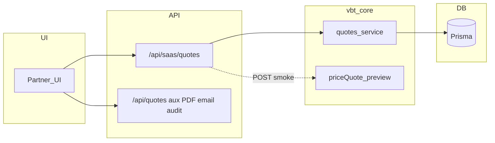
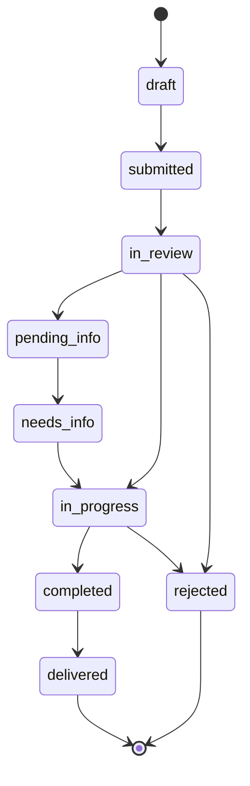

# Fase B — Consolidación de arquitectura (incremental)

Objetivo: capa API canónica bajo `/api/saas/*`, menos duplicación en el front donde el contrato coincide, cimientos de documentos e ingeniería, sin borrar rutas legacy ni romper pantallas.

---

## 1. Capas API (sin breaking changes)

### Tabla — dominios duplicados o relacionados

| Recurso | Ruta SaaS (CANONICAL) | Ruta legacy (DEPRECATED) | ¿La UI lo usa hoy? | Prioridad de migración |
|--------|------------------------|---------------------------|--------------------|-------------------------|
| Cotizaciones (lista/CRUD) | `GET/POST /api/saas/quotes`, `GET/PATCH/DELETE /api/saas/quotes/[id]` | `GET /api/quotes`, `.../quotes/[id]` | Mixto: CRUD partner → SaaS; lista en New Sale → legacy (forma distinta) | Alta para CRUD; media para lista enriquecida |
| Cotizaciones (PDF/email/audit) | — (pendiente unificar) | `.../quotes/[id]/pdf`, `/email`, `/audit` | Sí | Baja (mantener legacy hasta proxy) |
| Proyectos (lista/detalle/update) | `GET/POST /api/saas/projects`, `GET/PATCH /api/saas/projects/[id]` | `GET/POST /api/projects`, `GET/PATCH/DELETE /api/projects/[id]` | Lista/detalle migrados en varios clientes; crear/editar en páginas legacy puede seguir en `/api/projects` | Media (completar POST/PATCH/DELETE en UI) |
| Proyectos (logs) | — | `GET /api/projects/logs` | Sí (`ProjectLogsClient`) | Baja hasta exista SaaS |
| Clientes | — (no existe `/api/saas/clients`) | `GET/POST /api/clients`, `GET/PATCH/DELETE /api/clients/[id]` | Sí | Bloqueada hasta API SaaS |
| Documentos | `GET/POST /api/saas/documents` (+ subrutas) | No hay espejo legacy dedicado en app router | Sí (partner) | En curso vía `getVisibleDocuments` |

### Comentarios en código

- Rutas bajo `apps/web/src/app/api/saas/**`: cabeceras **CANONICAL** donde aplica.
- Rutas bajo `apps/web/src/app/api/projects/**`, `clients/**`, `quotes/**` (legacy): **@deprecated** con puntero a SaaS o “TBD”.

---

## 2. Migración de frontend (checklist)

### Hecho (formas seguras: `{ projects, total }`, mismo `getProjectById`)

- [x] `NewSaleClient` — `GET /api/saas/projects?limit=500` (cotizaciones siguen en `GET /api/quotes` por `enrichQuoteForSales`).
- [x] `SalesClient` — mismos proyectos SaaS.
- [x] `ProjectsClient` — búsqueda `GET /api/saas/projects?search=&limit=100`.
- [x] `quotes/create/page.tsx` — listado de proyectos SaaS.
- [x] `step1-method.tsx` — proyectos SaaS + etiquetas `projectCode` / `projectName`.
- [x] `step4-commission.tsx` — `GET /api/saas/projects/[id]`.

### Pendiente (riesgo de forma o ausencia de API)

- [ ] `NewSaleClient` — `GET /api/quotes` → SaaS cuando la respuesta incluya el mismo mapeo que `enrichQuoteForSales` (`factoryCostUsd`, `fobUsd`, `landedDdpUsd`, etc.).
- [ ] `projects/new/page.tsx`, `ProjectDetailClient` — `POST/PATCH/DELETE` y audit: legacy hasta alinear permisos y payloads con SaaS.
- [ ] `ProjectLogsClient` — sin ruta SaaS.
- [ ] Cualquier `fetch` a `/api/clients` — bloqueado hasta `/api/saas/clients`.

---

## 3. Flujo lógico único de datos de cotización

### Hoy

- **Crear (partner / flujo corto):** UI → `POST /api/saas/quotes` → `createQuote` en `@vbt/core` → Prisma.
- **Crear (wizard CSV legacy):** no usa `POST /api/quotes` (501); el flujo completo debe seguir el camino documentado del wizard hacia persistencia (revisar rutas específicas del import).
- **Leer/actualizar/borrar (dashboard partner):** UI → `/api/saas/quotes/...` → servicios core → DB.
- **Lista enriquecida para ventas:** `GET /api/quotes` aplica `enrichQuoteForSales` (marca VL + partner + costos derivados).
- **PDF / email / audit:** legacy bajo `/api/quotes/[id]/...`.

### Inconsistencias conocidas

- SaaS lista enmascara costos de fábrica para partners y expone `basePriceForPartner`; legacy lista devuelve filas “tipo venta” con nombres distintos.
- Totales persistidos siguen reglas del modelo Prisma + `createQuote`/`updateQuote`; la fachada `priceQuote` es composición pura (no escribe DB).

### Flujo canónico objetivo (diagrama)

---

## 4. Pricing facade y cotizaciones

### Dónde se calculan totales hoy

- **Persistencia:** `createQuote` / actualizaciones en `packages/core/src/services/quotes.ts` (campos `factoryCostTotal`, `totalPrice`, ítems, etc.).
- **Lista ventas (legacy):** `enrichQuoteForSales` en `apps/web/src/app/api/quotes/route.ts`.
- **UI wizard:** pasos locales + envío al guardar (según ruta usada).

### Dónde se usa la fachada ahora

- **Fase C:** `POST /api/saas/quotes` usa `priceSaaSQuoteLayers` antes de persistir: compara `totalPrice` (warning si difiere), rellena total sugerido si falta, y `validateQuoteTotals` tras crear (solo logs). Ver [phase-c-pricing-consistency.md](./phase-c-pricing-consistency.md).

### Riesgo

- El preview **no** replica el stack completo VL + impuestos del producto; sirve para cableado incremental, no para validación financiera.

---

## 5. Visibilidad de documentos (`getVisibleDocuments`)

### Qué había

- `listDocuments` en `@vbt/core` con filtros por categoría, visibilidad, país, org, etc.

### Qué se añadió

- `excludeVisibilities` en `listDocuments`.
- `getVisibleDocuments(prisma, ctx, options)` en `packages/core/src/services/documents.ts`:
  - **Superadmin:** mismo poder que `listDocuments`, sin ocultar `internal` salvo filtros explícitos.
  - **Partner:** fuerza `organizationId` del tenant y excluye `visibility: internal`.
- `GET /api/saas/documents` usa `getVisibleDocuments`.

### Pendiente

- Pasar `countryCode` del perfil de org al contexto cuando exista fuente única.
- Reglas por `role` (p. ej. `technical_user`) — campo reservado en el tipo.

---

## 6. Ingeniería — modelo y propuesta (sin UI)

### Estados (`EngineeringRequestStatus`)

`draft` → `submitted` → `in_review` ↔ `pending_info` / `needs_info` → `in_progress` → `completed` → `delivered`; `rejected` desde varios puntos.

### Entidades

- **EngineeringRequest:** cabecera por org + proyecto, fee, fechas, asignación.
- **EngineeringFile:** adjuntos de entrada.
- **EngineeringDeliverable:** entregables versionados.

### Propuesta mínima de API (alineada a SaaS)

- `GET/POST /api/saas/engineering` — lista / crear.
- `GET/PATCH /api/saas/engineering/[id]` — detalle / transición de estado (validar máquina en core).
- `POST /api/saas/engineering/[id]/files` — subida (ya puede existir parcialmente).
- Servicio core: `transitionEngineeringRequest(prisma, ctx, id, { status, ... })` con tabla de transiciones permitidas.

---

## Resumen por sección

| Sección | Hoy | Cambiado | Pendiente | Riesgo |
|--------|-----|----------|-----------|--------|
| API layers | Duplicidad quotes/projects/clients | Comentarios CANONICAL/DEPRECATED; docs | SaaS clients; proxy PDF/email | Confusión hasta migrar lista quotes |
| Front | Mezcla `/api/*` | Proyectos → SaaS en listas seguras | New Sale quotes; CRUD proyecto | Bajo en cambios hechos |
| Quote flow | Dos formas lista + aux legacy | Doc + preview pricing en POST SaaS | Unificar enriquecimiento | Preview no equivale a totales reales |
| Pricing | Core + legacy enrich | `void preview` en POST SaaS | Sustituir cálculos gradualmente | Desalineación si se confía en preview |
| Documents | `listDocuments` | `getVisibleDocuments` + ruta SaaS | Rol/país automático | Superadmin sin org sigue viendo todo |
| Engineering | Modelo + rutas existentes | Documentación máquina + API sketch | Implementar transiciones en core | Estados legacy vs reglas nuevas |

---

*Última actualización: consolidación Fase B (incremental).*
